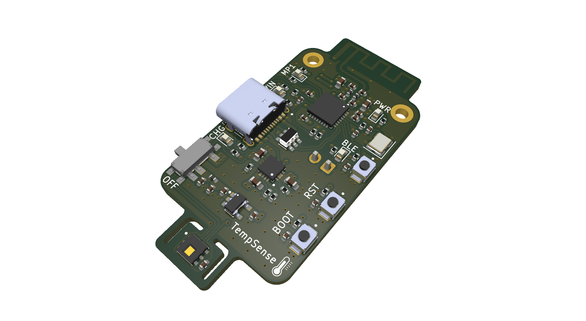
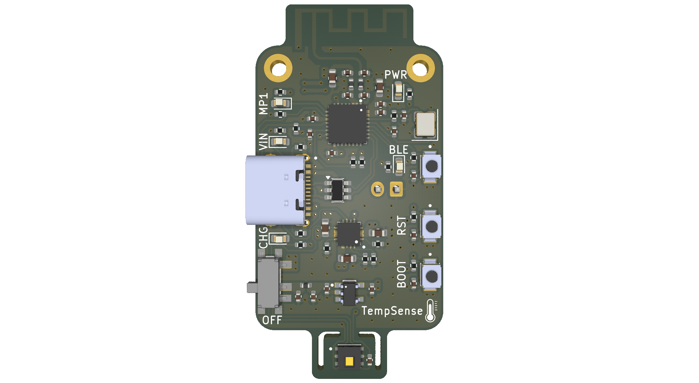
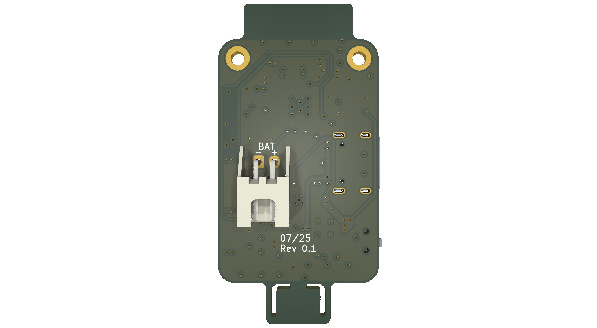
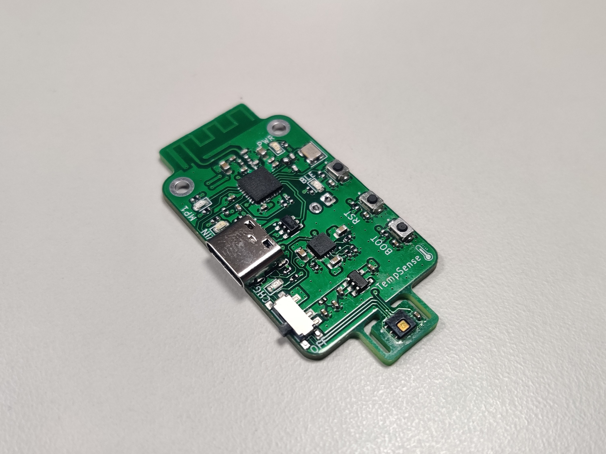

# TempSense - ESP32-C3FH4 temperature logger Rev 0.1
*Micah Tritscher 07/25*

Wireless ESP32-C3FH4 based battery powered HDC1080DMBR temperature and humidty logger, with USB Type-C charging.

### Features
- I2C Texas Instruments HDC1080DMBR humidity and temperature sensor
- Impedance matched PCB antenna from TI AN043 application: https://www.ti.com/lit/an/swra117d/swra117d.pdf
- USB Type-C charging and programming
- BQ24074RGTR charging circuit (Designed for 500 mAh LiPO battery)

### Images
KiCAD 9.0 Renders

Manufactured by JLCPCB, assembled by hand

